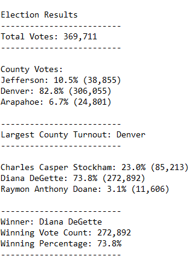

# Election Analysis

## Project Overview
This includes an election audit for a local congressional election, as requested by a Colorado Board of Elections. 
This involved:
1. Calculating the total number of votes cast
2. Creating a list of the candidates who received votes
3. Counting the number of votes each candidate received
4. Calculating the percentage of votes each candidate won
5. Determining the winner of the election based on the popular vote
6. Counting the number of votes cast in each county
7. Determining the county with the highest voter turnout

## Resources
- Data source: election_results.csv
- Software: Python 3.7.6, Visual Studio Code 1.61.0

## Results
The analysis of the election data gives us the following information:

- There were 369,711 total votes cast in this election.
- Votes cast by county:
    - Jefferson had 38,855 votes cast, or 10.5% of the total votes.
    - Denver had 306,055 votes cast, or 82.8% of the total votes.
    - Arapahoe had 24,801 votes cast, or 6.7% of the total votes.
- The county with the highest voter turnout:
    - Denver county, with 306,055 votes, or 82.8% of the total votes. 
- The results by candidate were:
    - Charles Casper Stockham received 85,213 votes, or 23.0% of the total votes.
    - Diana DeGette received 272,892 votes, or 73.8% of the total votes.
    - Raymon Anthony Doane received 11,606 votes, or 3.1% of the total votes.
- The winner of this election was:
    - Diana DeGette, with 272892 votes, or 73.8% of the total votes.

When ran, the code gives us this output; 

  


## Summary 
The code is already fairly versatile and can be adapted for use for other elections with minimal modifications. Instead of listing out the candidates or counties, our code runs through the rows in the data source file and finds each unique entry and creates a list of them. For this reason, this code can easily be applied to other elections, including ones with more or less candidates or counties. 

However, this code is written assuming that the data will be organized in the same way for each data source file - namely, the candidates being listed in the third column and counties listed in the second column. In order to prevent the code creating an issue for other elections, we can set a variable such as column_number and the user can input which column number the candidate or county name appears in. Then, we can use this variable and run row[column_number - 1] to find the data in the relevant column. Otherwise, the code will only search the second and third columns for county and candidate, which may not be appearing in the same cells. 

Current code;
```
for row in reader:
candidate_name = row[2]
county_name = row[1]
```

Suggested code (with variables initialized as column numbers for relevant data);
```
for row in reader:
candidate_name = row[candidate_column_number - 1]
county_name = row[county_column_number - 1]
```

Although my code is written for a local congressional election, which means votes are state-wide and can be referenced by county, I can alter the code to instead search for votes cast by state for a federal election, or by city for a county election. The code itself would not have to change much, other than renaming certain variables to more appropriate names, like state_options or city_vote_count instead of candidate_options and county_vote_count. The code is already adaptable and generic to be able to work with these formats, as long as the code is searching for the correct data in the column it is found in. 

For future elections, this code would need to be adapted to ensure the name of the csv file (or otherwise formatted data source file) was correctly represented in our code, as well as the path for the location of the file.

The following code was used to open our data source file and save it to an output text file;
```
file_to_load = os.path.join("Resources", "election_results.csv")
file_to_save = os.path.join("Analysis", "election_analysis.txt")
```

This code requires us to have the data source file to be named "election_results.csv" and be placed in a folder named "Resources" on the same level as the code file. If it is not, this code would need to be edited, or the file would have to be moved.

Another option to solve this issue is that we could initialize a variable called data_source_file and set it equal to the file name for the given election data, along with a comment in the code letting whoever runs the code to change that to the file name and ensure the location is correctly routed to. This will allow users to adapt the code we wrote for any future election analysis project, but only after knowing the exact parameters of the other election. 
